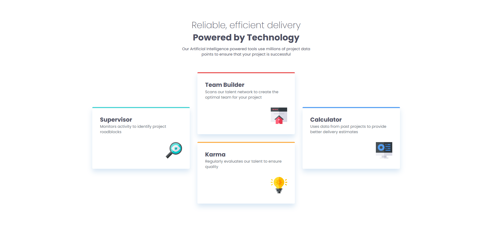

# Frontend Mentor - Four card feature section solution

This is a solution to the [Four card feature section challenge on Frontend Mentor](https://www.frontendmentor.io/challenges/four-card-feature-section-weK1eFYK). Frontend Mentor challenges help you improve your coding skills by building realistic projects.

## Table of contents

-   [Overview](#overview)
    -   [The challenge](#the-challenge)
    -   [Screenshot](#screenshot)
    -   [Links](#links)
-   [Built with](#built-with)
-   [Acknowledgments](#acknowledgments)

## Overview

### The challenge

Users should be able to:

-   View the optimal layout for the site depending on their device's screen size

### Screenshot

### Links

-   Solution URL: https://github.com/Dorm-24/Four-card-feature-section
-   Live Site URL: https://dorm-24.github.io/Four-card-feature-section/

## Built with

-   Semantic HTML5 markup
-   CSS custom properties
-   CSS Grid
-   Mobile-first workflow

## Acknowledgments

I sometimes got stuck on some small problems, so I looked at [Kevin Powell's solution](https://www.youtube.com/watch?v=JFbxl_VmIx0&t=3467s). Big thanks to him!
